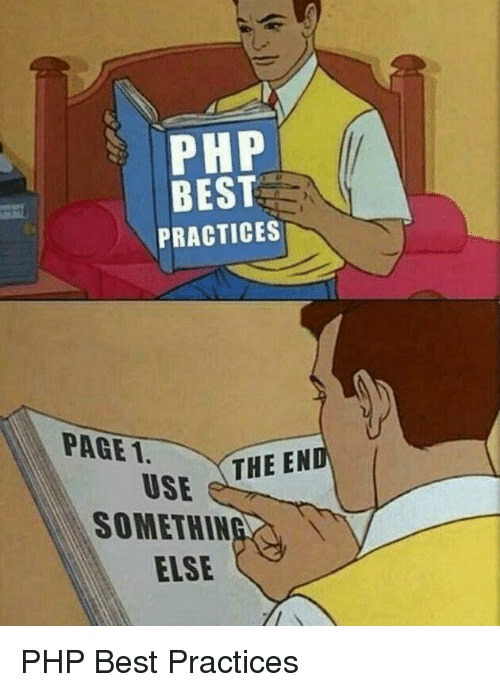

This is my first post, and I wish my blog to be a mix of a little bit of tech that I know about and how did I reach there. More or less like Ted Mosby, but with different stacks instead of different girls. And thanks to the [university](https://nitk.ac.in) I go to and the bunch of super geeks I see at [IEEE NITK](https://ieee-nitk.github.io), I have multiple [Barney Stinsons](https://ieee-nitk.github.io/team.html) in my life.

So it all started in 2016, 1st of January when my resolution was to learn web dev. Basically new year eve I was in hostel, in my room, thanks to the hostel timings, so the way new year appeared in my life was as a google doodle which was an egg till 31st 23:59:59 and hatched exactly at midnight. So the freshman decided to learn _"Hypertext Preprocessor"_(:P) back then because he had noticed the url `facebook.com/home.php`. So if I write a code in php, say something like this,

<?php
	echo "Hello World!";
?>


and saved it as `index.php`, double click that file, it just showed the exact same thing in my browser too, aw, come on! Why can't google chrome execute a simple php file? This sucks. Chrome sucks.

It took me four months, to figure out stuff.

And back then I was a do-it-all by myself kind guy with limited googling skills, with awesome experience in writing code which next day would look like overcooked spaghetti kept in a freezer. Coming back to college, I realized I hated electronics, so I used to still tweak and try out stuff with js even during exam times, including stuff like a [snake game](https://viggi-v.github.io/sgame/).

Meanwhile I had joined IEEE NITK, and my first project was in NLP. To be honest I joined because AI sounded cool. And oh, I was still with windows. So initial reading assignments were fun, I was reading the famous [Deep Learning Book](http://www.deeplearningbook.org/) and things were cool. Once we started coding, obviosly I never got to a phase where tensorflow would run in my conda environment set up in a windows 8 running on an i3 machine, so I ended up, tada! making the ui for the project. Needless to say I was lazy to get acquinted by the development cycle for ml, and was comfortable with setting up a project in laravel, writing migrations and creating a rest api wrapping with an angular front end. So never explored further.

During summer, due to all the bashings I got from seniors and the world of memes called the internet, I decided to leave till then what I used to call as my mother tongue, php, and learn MEAN Stack. Mainly because till then first search result for MEAN was `mean girls` in my laptop and, also, I found an awesome site called [scotch.io](https://scotch.io)

Being a developer(sorry for calling myself so), I loved all my courses which included hitting the keyboard. Be it in matlab(Digital Signal Processing), assembly(microprocessors) or vhdl(digital system design). So I met vhdl in a course taken by a prof who is still super great but super scary, Sumam David. Her teaching curve sometimes resembles what happened [here](https://charts.bitcoin.com/chart/price) from beginning of universe till December 11, 2017, still I started liking it. After all we were just making simple FSMs and basic circuits, in a board with tens of thousands of lookup tables and 100s of DSPs(_Sorry, but you can just think of it like buying a kit to make biriyani and then just taking a pinch of spices from it, tasting and saying "voila!"_). Needless to say never bothered to check anything other than the right LEDs blinking in the board(which, as you are going to see soon, backfires). With additional knowledge about memes on vhdl as well, I figured out that I can call myself good in VHDL and indeed, added it to my resume and linkedIn.

Now fast forward to May 7, 2018, and I promise I will come back on how me and vhdl were on a break and I tried verilog, but another day.

## My Internship at HEPIA, Geneva.

I had a research internship offer from [HEPIA](http://hepia.hesge.ch/) on the field of **Deep Learning on FPGAs**. Yeah, you heard it right :P.

With my knowledge of how feedforward nets work, zero coding experience in tensorflow or torch, and basic VHDL skills, I grabbed my passport and went on an adventure. And for a month all I did was to read 10+ research papers and blogs every day on (insert every alphabet here)NNs, and how to compress their trained net size or how to parallelize them. Due to [many reasons](https://karpathy.github.io/2015/05/21/rnn-effectiveness/), I found LSTMs super cool, and I learnt about it in a [fun way](https://colah.github.io/posts/2015-08-Understanding-LSTMs/).

So now comes a lot of stories about me meddling with vhdl, and sometimes even begging and crying in front of the monitor to get it running. I personally felt that JS or any web dev community is like french people, super sweet while VHDL community is like Germans, and I don't wanna talk about them (_or about the multiple questions I ended up deleting in electronics stack exchange due to excessive number of downvotes and mean comments_). So my next few posts would be vhdl based, but I promise you that I will explain it in a way everyone would understand.