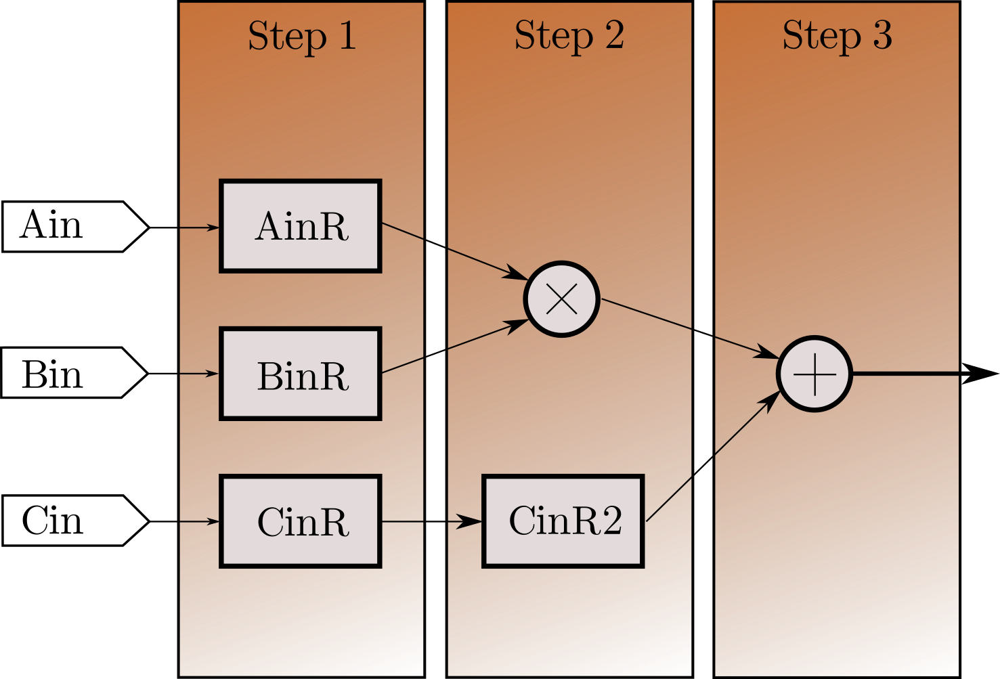

It did take me quite some time(3 minutes) and some effort(reading a [wikipedia article](https://en.wikipedia.org/wiki/VHDL)) to convince myself that VHDL was not originally written to "code" FPGAs.

We all would have probably seen a bread board before; it is a simple prototyping tool with horizontal or vertical connections and we can plug in components and make any circuit we want, with it, constrained to the availability of slots. FPGAs are just the same, when we talk about what it offers. They originally have a set of Look Up Tables(LUTs) and DSP blocks. We can set the logic output for any input combinations in an LUT, not necessarily explainable by a simple function like `d = a xor b xor c`. DSP blocks are tiny processing element with multipliers and adders inside, which are of fixed-length, and could be used for faster computation. And when we are "coding" an FPGA, what we are essentially doing is, describing a hardware, using any Hardware Description Language like VHDL or Verilog, and then using a synthesiser to generate an appropriate circuit made up of these LUTs and DSP Blocks which would best describe the hardware we wrote using out HDL. It makes FPGAs and the way we configure it using VHDL, entirely different from other embedded systems for two reasons, 
1. We are not "programming" per se, we are designing a hardware.
2. VHDL is not a sequentially executable language, and the code isn't "running" in my hardware, it is getting implemented on it.

## How it feels like to do something in VHDL

> Disclaimer: I am writing this blog in a way everyone would be able to understand it. This is not intended to teach you VHDL, but to give you a fun reading experience about what's happening there. Also, while learning VHDL, for quite a long time, I had treated it like any other programming language, so had a lot of misconceptions about it. So most of my content in this blog are stuff which surprised me or gave me a nice, good feeling. That said, if you are already an expert in VHDL, you may not find these very surprising.

Now, since VHDL is a description language, and since it does not get executed sequentially always, except for `process` blocks, it gives us a much different approach to getting things done. Now, I am taking up the liberty to not go through an entire tutorial to vhdl, but show you something fun, and these are the points you need to know in the worst case.

1. `Signal` is _like_ a variable in C, for use case, but acts like a _wire_ in physical sense(?!)(_There is something called variable too in VHDL, not necessary for right now_)(_wires gets interesting later, in Verilog_). For the time being, we can "store stuff" in a signal.
2. Inside a `process`, statements get executed sequentially.
3. Assignment is done with an operator that looks like `<=`, and even if we assign a signal with some value inside a `process`, the signal updation happends only after the `process` is done.
4. A `process` is invoked only if any signal mentioned in it's sensitivity list changes.
5. Just to mess up with your mind, it is just a fact that a `process` gets executed in zero time, about which I hope to write better in future. You can read [this](https://stackoverflow.com/q/13954193/6319742), which has pretty great answers.

Now coming to the problem.

What we are trying to do is to make a circuit, which will have three inputs, `Ain`, `Bin` and `Cin`, and finds an output `SumR = Ain*Bin + Cin`. And we have to try to make this circuit take up less space, and also try to make sure it gets a better performance, for instance if we have a 1000 `Ain`s, `Bin`s and `Cin`s.

Now if we directly do `SumR = Ain*Bin + Cin`, the synthesiser is forced to generate hardware which would find this result in a single clock cycle, since `SumR` must be updated right after the process. But we want to avoid it by trading off speed, by making a dummy signal, `MulR = Ain*Bin` and then later doing `SumR <= MulR + Cin`. So here is a simple vhdl snippet, which I personally loved.



-- Assume Ain,Bin and Cin are 8 bit width signals, 
-- or Standard Logic Vectors.
-- Assume we have a clock signal as an input, called clk.
signal AinR, BinR, CinR : std_logic_vector(7 downto 0);
signal MulR : std_logic_vector(15 downto 0);
signal SumR : std_logic_vector(16 downto 0);
multiplier:process(clk) 
	-- by this, we mention that clk should be in the 
	-- sensitivity list of the process
	begin
		AinR <= Ain;
		BinR <= Bin;
		CinR <= Cin;
		
		MulR  <= AinR*BinR;
		CinR2 <= Cin;
		
		SumR  <= MulR + CinR2;
	end process;



The seemingly harmless (and jobless) assignments of `AinR`,`BinR`,`CinR` and `CinR2` adds a pretty magical change to this code, and makes it **Pipelined!!!**. 

> Pipelining is a technique used in lot of areas to increase throughput. Imagine you have a single copy of a 30 page document and 30 students, and each student takes a single minute to read a single page. Instead of giving the entire document as such to the first student, then him finishing it, passing on to second student etc would take 900 minutes for the process to finish. Instead, if we split the document to 30 individual pages, and give the first student the first page, and ask him to take second page and pass on the first one once he is done, we can finish the task in (30 + 29) = 59 minutes, and this math is intuitive. This is the basic idea of pipelining, to break down a process into tinier processes, so that we can ensure maximum usage of resources. The delay of initial 30 minutes here is called *latency* of the design.

Here, since we know that every signal updation happens only after process gets suspended, `AinR`, `BinR`, `CinR` and `CinR2` acts like slots in a conveyor belt. The circuit generated more or less looks like this,

(_The actual interconnects generated would depend on the FPGA used, and it may take up a single DSP block and extra flip flops in most cases._)

So the extra assignments inside a process statement forced the synthesiser to reserve extra flipflops for each signal, and thus we can feed in a set of 1000 inputs and still get the complete output in 1003 clock cycles instead of 3000 clock cycles.

This was the simplified version of the multiplier unit I used in my project, and I had to make sure my synthesiser would implement this in a DSP block, as the FPGA I was working with([Artix 7](https://www.xilinx.com/products/silicon-devices/fpga/artix-7.html)) had plenty(740) of them. Also, with the expense of few extra LUTs per multiplier I was able to get a much better throughput. I thought, I really thought, "Ah, problem solved! This was easy" and went on the weekend trip to Rome, which effectively spoiled Dominos and Pizza-Hut for the rest of my life. Sorry Onesta though, I knew you sucked even before I went to Rome.

